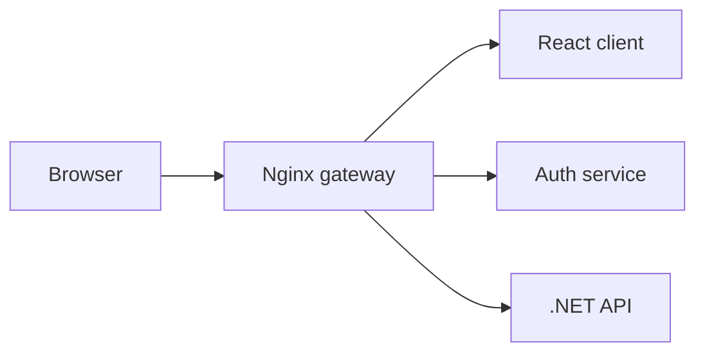

<div align="center">

# DOMIX

### A container-ready foundation for a modern multi-service web platform

[](https://react.dev/)
[](https://vite.dev/)
[](https://dotnet.microsoft.com/)
[](https://docs.docker.com/compose/)
[](https://nginx.org/)

</div>

## Overview

DOMIX is an early-stage full-stack project structured as a small service-oriented platform. It separates the user interface, authentication service, application API, and reverse proxy so that each component can evolve independently.

The repository currently provides the project foundation and container configuration. Product features, persistence, authentication flows, and production hardening are still under active development.

## Architecture



| Component | Technology | Purpose |
| --- | --- | --- |
| `domix-client` | React 19, Vite 8 | Browser application |
| `auth-server` | Node.js 20 | Authentication service scaffold |
| `domix-server` | ASP.NET Core / .NET 10 | Main application API scaffold |
| `nginx` | Nginx | Static hosting and API routing |
| `docker-compose.yml` | Docker Compose | Local service orchestration |

## Repository structure

```text
domix/
├── auth-server/       # Authentication service scaffold
├── domix-client/      # React and Vite frontend
├── domix-server/      # ASP.NET Core API
├── nginx/             # Reverse-proxy configuration
├── docker-compose.yml # Multi-service development stack
└── README.md
```

## Prerequisites

For container-based development:

- Docker Desktop with Docker Compose

For running individual services:

- Node.js 20 or newer
- npm
- .NET 10 SDK

## Frontend development

```bash
cd domix-client
npm install
npm run dev
```

Useful commands:

```bash
npm run build
npm run lint
npm run preview
```

## API development

```bash
cd domix-server
dotnet restore
dotnet run
```

When the API runs in the Development environment, its OpenAPI document is exposed by ASP.NET Core.

## Container status

The repository includes Dockerfiles, Docker Compose configuration, and an Nginx routing configuration. The container stack is still being completed. In particular:

- the authentication service needs its application source and package manifest;
- the .NET Dockerfile project path needs to be aligned with the current `.csproj` file;
- the gateway image needs to include the repository's Nginx configuration;
- environment-variable examples still need documented, non-secret defaults.

These items are intentionally listed here so contributors can distinguish the current scaffold from production-ready functionality.

## Roadmap

- [ ] Complete the authentication service
- [ ] Replace the sample API endpoint with DOMIX domain endpoints
- [ ] Add database persistence and migrations
- [ ] Complete Docker Compose startup
- [ ] Add automated tests
- [ ] Add CI checks for frontend and backend builds
- [ ] Document configuration and deployment
- [ ] Add screenshots and a hosted demo

## Contributing

Changes should be developed on a dedicated branch and submitted through a pull request. Keep each pull request focused, explain the reason for the change, and include the validation commands that were run.

## Author

Created by [ayal408](https://github.com/ayal408).

Portfolio: [A4U](https://ayal408.github.io/a4u/)
