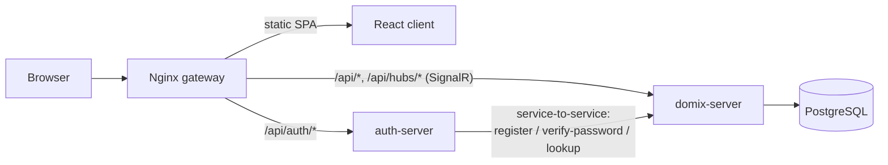

<div align="center">

# DOMIX

### An apartment-brokerage platform — search, list, message, and manage rentals

[](https://react.dev/)
[](https://www.typescriptlang.org/)
[](https://vite.dev/)
[](https://dotnet.microsoft.com/)
[](https://www.postgresql.org/)
[](https://docs.docker.com/compose/)
[](https://nginx.org/)

</div>

## Overview

DOMIX is a full-stack apartment-brokerage platform: users search and filter listings on a map,
save searches, message landlords/agents in real time, and manage their account; admins moderate
listings, users, and support tickets from a dedicated panel. It's built as four services that can
each be developed and deployed independently:

- **`domix-client`** — the browser application (React + TypeScript)
- **`auth-server`** — a thin authentication/session layer (Node.js + Express)
- **`domix-server`** — the main data API (ASP.NET Core), owns the Postgres database
- **`nginx`** — the gateway that serves the SPA and routes API/WebSocket traffic to the two
  backend services

## Features

- Apartment search with map view (clustering, distance, filters), saved searches with email
  alerts, and a mortgage calculator
- Real-time messaging between users, with online-presence indicators (SignalR)
- Email/password and Google sign-in, with email verification and password reset
- Favorites, a comparison view, and a support/contact flow
- An admin panel for managing listings, users, notifications, analytics, and support tickets
- Localized UI (English, Hebrew, Spanish, French — with right-to-left layout for Hebrew)
- Server-rendered link previews for social crawlers (WhatsApp/Facebook/etc.) sharing a listing

## Architecture


```mermaid
flowchart LR
    U[Browser] --> G[Nginx gateway]
    G -- static SPA --> C[React client]
    G -- "/api/auth/*" --> A[auth-server]
    G -- "/api/*, /api/hubs/* (SignalR)" --> S[domix-server]
    A -- "service-to-service:<br/>register / verify-password / lookup" --> S
    S --> P[(PostgreSQL)]
```

`auth-server` never talks to the database directly or holds password hashes beyond a single
request — it asks `domix-server` to create the user or verify a password, and issues its own
JWTs (an access token returned to the client, a refresh token as an httpOnly cookie) once
`domix-server` confirms the result. `domix-server` is the only service with a database
connection; it also serves uploaded apartment photos and owns the real-time presence hub.

| Component | Technology | Role |
| --- | --- | --- |
| `domix-client` | React 19, TypeScript, Vite 8, TanStack Query, Zustand, Tailwind, Leaflet, i18next | Browser application |
| `auth-server` | Node.js, Express, JWT, Google Identity Services | Authentication / session layer |
| `domix-server` | ASP.NET Core / .NET 10, EF Core, Npgsql, SignalR, Serilog | Data API, owns Postgres |
| `nginx` | Nginx | Static hosting, API/WebSocket routing, image caching, bot-friendly OG previews |
| `docker-compose.yml` | Docker Compose | Local multi-service orchestration |

## Repository structure

```text
domix/
├── auth-server/         # Express authentication service
├── domix-client/        # React + TypeScript frontend
├── domix-server/        # ASP.NET Core data API
├── domix-server.Tests/  # domix-server unit tests (xUnit)
├── nginx/               # Reverse-proxy Dockerfile
├── integration-tests/   # End-to-end tests: auth-server + domix-server + Postgres together
├── docker-compose.yml   # Multi-service development stack
└── README.md
```

## Prerequisites

For container-based development:

- Docker with Docker Compose

For running services individually:

- Node.js 22.12+ (`domix-client`'s test tooling — vitest, jsdom — requires it; CI runs 22.22.2.
  An older Node either warns `EBADENGINE` on install or crashes at test/build time)
- .NET 10 SDK
- PostgreSQL 16 (or run it via `docker run postgres:16-alpine`)

## Running the full stack with Docker Compose

```bash
cp .env.example .env                          # ports + VITE_GOOGLE_CLIENT_ID (optional)
cp auth-server/.env.example auth-server/.env   # fill in JWT_SECRET, GOOGLE_CLIENT_ID, INTERNAL_SERVICE_KEY, ...
cp domix-server/.env.example domix-server/.env # fill in JWT_SECRET, INTERNAL_SERVICE_KEY, Gmail/Gemini credentials, ...
docker compose up --build
```

The gateway serves the app at `http://localhost` (override with `NGINX_PORT`). `docker-compose.yml`
overrides a couple of values from each `.env` automatically (container hostnames instead of
`localhost`) — no manual edits needed to switch between running a service standalone and running
it via Compose. `INTERNAL_SERVICE_KEY` is the one value that must be set to the *exact same string*
in both `auth-server/.env` and `domix-server/.env` — it's how domix-server tells a call from
auth-server apart from an arbitrary caller on the internal network (see
`domix-server/ApartmentAPI/Security/InternalOnlyAttribute.cs`).

## Running services individually (no Docker)

### Frontend

```bash
cd domix-client
npm install
cp .env.example .env   # or .env.local
npm run dev
```

Other useful commands: `npm run build`, `npm run lint`, `npm run typecheck`, `npm test`.

### Auth service

```bash
cd auth-server
npm install
cp .env.example .env   # fill in JWT_SECRET (32+ chars), INTERNAL_SERVICE_KEY, and DATA_SERVICE_URL
npm start
```

### Data API

```bash
cd domix-server
cp .env.example .env   # fill in DEFAULT_CONNECTION (a running Postgres), JWT_SECRET, and INTERNAL_SERVICE_KEY
dotnet restore
dotnet run
```

EF Core migrations run automatically on startup. In the Development environment, Swagger is
served at `/swagger`.

## Environment variables

Every `.env.example` in this repo is a real, fillable template (not just a list of names) —
these are the values worth knowing about beyond "copy the file":

| Variable | Where | Notes |
| --- | --- | --- |
| `JWT_SECRET` | `auth-server`, `domix-server` | Must be the *exact same string* in both, 32+ chars (the app refuses to start otherwise) — `auth-server` issues the access token, but the browser sends that same token straight to `domix-server` too (see `domix-client/src/api/http.ts`), so `domix-server` must be able to verify auth-server's signature. |
| `INTERNAL_SERVICE_KEY` | `auth-server`, `domix-server` | Also must be the *exact same string* in both, but for a different reason — see the note under [Docker Compose](#running-the-full-stack-with-docker-compose) above. |
| `DATA_SERVICE_URL` / `DEFAULT_CONNECTION` | `auth-server` / `domix-server` | Where each service finds the other service / the database. `docker-compose.yml` overrides both automatically for container-to-container use — only edit them for standalone runs. |
| `PORT` | all three services | Optional; each falls back to a sensible default (8080 for `domix-server`, 5000 for `auth-server`, `--port` for Vite) if unset. |
| `GOOGLE_CLIENT_ID` (`auth-server`) / `VITE_GOOGLE_CLIENT_ID` (`domix-client`) | Google sign-in | Both must be the *same* OAuth 2.0 Client ID from a [Google Cloud project](https://console.cloud.google.com/apis/credentials) (Web application type). Leave both empty to build/run without the "Continue with Google" button — nothing else breaks. |
| `GMAIL__EMAIL`, `GMAIL__CLIENTID`, `GMAIL__CLIENTSECRET`, `GMAIL__REFRESHTOKEN` | `domix-server` | Gmail API OAuth credentials used to send verification/reset/notification emails. Get them from a Google Cloud project with the Gmail API enabled (client id/secret) and the [OAuth Playground](https://developers.google.com/oauthplayground) (refresh token, scope `https://mail.google.com/`). Leave unset and the app still runs fine — `EmailService` logs the failure and continues rather than throwing (see `SavedSearchAlertBackgroundService`'s doc comment). |
| `GEMINI_API_KEY` | `domix-server` | Powers the chat widget. Get one from [Google AI Studio](https://aistudio.google.com/apikey). Leave unset and the app itself still starts and runs fine — only a request to the chat endpoint 500s (checked directly: `ChatService`'s constructor throws before its own try/catch ever runs, so it's a plain 500, not a friendly error). |
| `CLIENT_APP_URL` | `domix-server` | Base URL used to build links inside emails (verification, password reset, saved-search alerts, support notifications). Must match wherever `domix-client` is actually reachable — see the comment in `domix-server/.env.example` for the Compose-vs-Vite-dev-server values. |
| `ADMIN_NOTIFICATION_EMAIL` | `domix-server` | Where "Ask the team" chat escalations and support tickets get emailed. Leave empty to skip that notification — tickets still land in the admin support inbox either way. |

## Testing

| Suite | Command | What it covers |
| --- | --- | --- |
| `domix-client` | `cd domix-client && npm test` | Component/hook unit tests (Vitest), including automated accessibility checks (axe-core) on shared UI components |
| `domix-server.Tests` | `cd domix-server.Tests && dotnet test` | `domix-server` unit tests (xUnit) |
| `integration-tests` | `cd integration-tests && npm test` | `auth-server` + `domix-server` + Postgres together, real HTTP, no mocking — see [`integration-tests/README.md`](integration-tests/README.md) |

## CI

GitHub Actions (`.github/workflows/ci.yml`) runs on every push/PR to `dev`: frontend
lint/typecheck/test/build, an auth-server syntax check, a domix-server build + unit tests, and the
full integration-test suite against a Postgres service container.

## Roadmap

- [x] Complete the authentication service
- [x] Replace the sample API endpoint with DOMIX domain endpoints
- [x] Add database persistence and migrations
- [x] Complete Docker Compose startup
- [x] Add automated tests (frontend + domix-server unit tests, accessibility checks, service-to-service integration tests)
- [x] Add CI checks for frontend and backend builds
- [x] Document environment variables in full (Gmail, Gemini, Google OAuth setup)
- [ ] Add screenshots and a hosted demo

## Contributing

Changes should be developed on a dedicated branch and submitted through a pull request. Keep each
pull request focused, explain the reason for the change, and include the validation commands that
were run.

## Author

Created by [ayal408](https://github.com/ayal408).

Portfolio: [A4U](https://ayal408.github.io/a4u/)
